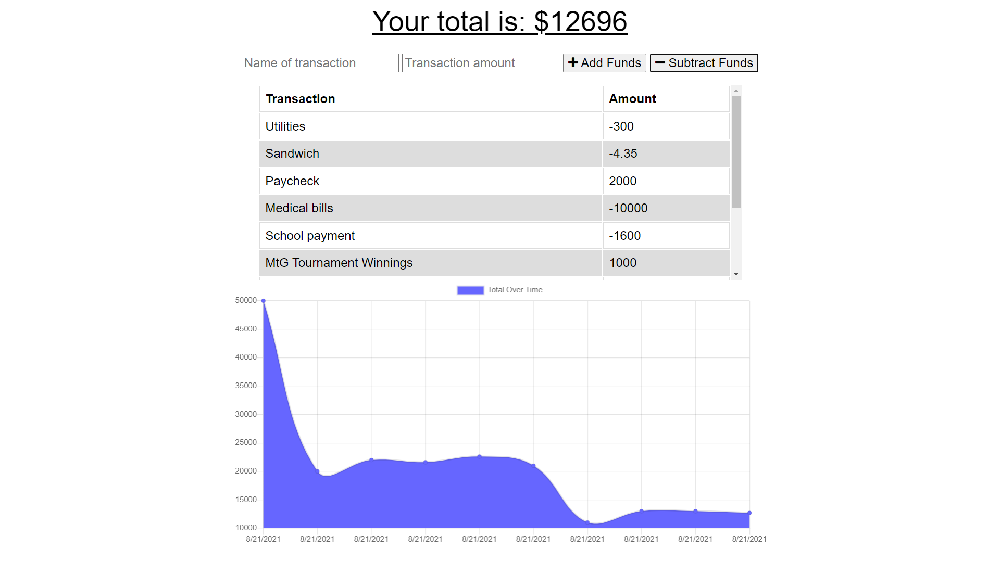

# PWA Budget Tracker 

## Description
This application is a budget tracker app that allows users to input transaction information to be graphed and tracked over time.  Utilising indexedDB, the app has offline functionality that allows that server to be updated upon re-establishing an internet connection. The back-end is constructed with a MongoDB database. The application is deployed via Heroku.

## Demo
Check out the live app [HERE](https://fast-ocean-80968.herokuapp.com/)
